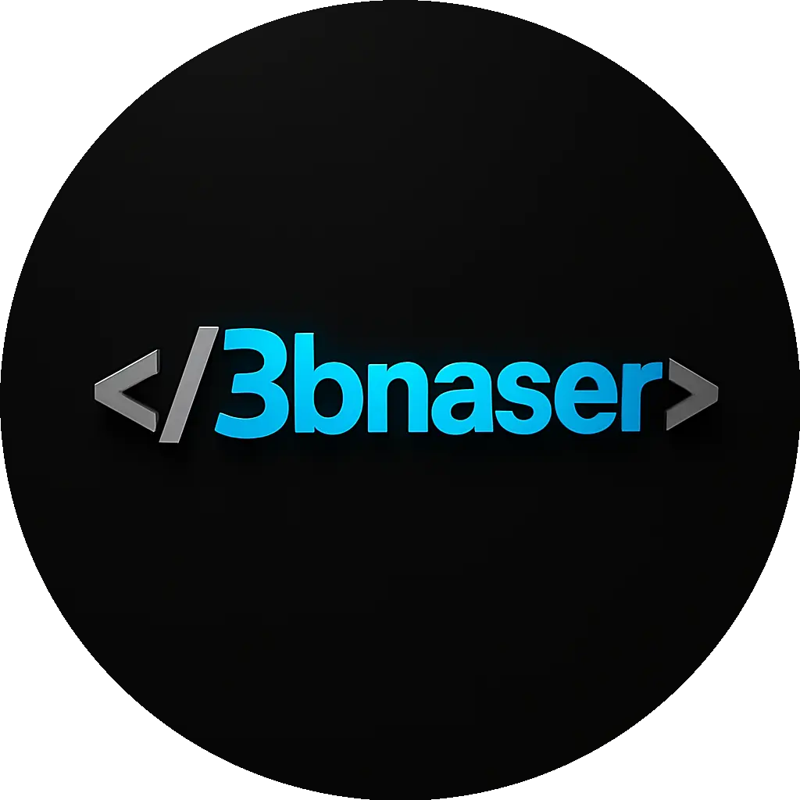

# Mohamed Abdelnaser | Front-End Developer Portfolio

<div align="center">



[](https://3bnaser.tech/)
[](https://github.com/Mo7amed-3bnaser)
[](https://www.linkedin.com/in/3bnaser)

</div>

## 🚀 Overview

Professional portfolio website showcasing my skills, projects, and experience as a Front-End Developer. Built with modern web technologies and optimized for performance across all devices.

## ✨ Features

### 🎨 Design & UX
- **Modern & Attractive Interface** - Clean, professional design with smooth animations
- **Fully Responsive** - Optimized for mobile, tablet, and desktop
- **Dark Theme** - Eye-friendly dark color scheme with blue accents
- **Particle Effects** - Interactive background animations using Particles.js
- **Smooth Scrolling** - Seamless navigation with scroll animations

### 🛠️ Technical Features
- **Performance Optimized** - Fast loading with code splitting and lazy loading
- **SEO Friendly** - Complete meta tags, structured data, and sitemap
- **PWA Ready** - Progressive Web App capabilities with manifest
- **Accessibility** - WCAG compliant with ARIA labels and keyboard navigation
- **Cross-Browser Compatible** - Works on all modern browsers

### 📱 Sections
- **Hero Section** - Eye-catching introduction with animated typing effect
- **About** - Professional bio with stats and contact info
- **Skills** - Categorized technical skills with progress indicators
- **Services** - What I can do for you
- **Projects** - Featured work with live demos and source code
- **Contact** - Working contact form with Formspree integration

## 🛠️ Technologies Used

### Front-End
- HTML5 (Semantic markup)
- CSS3 (Modern features, Grid, Flexbox)
- JavaScript ES6+ (Vanilla JS, no frameworks)
- Bootstrap 5 (Responsive grid system)

### Libraries & Tools
- **Particles.js** - Interactive background effects
- **AOS (Animate On Scroll)** - Scroll animations
- **Typed.js** - Typing animation effect
- **Font Awesome** - Professional icons
- **Google Fonts** - Poppins & Roboto typography

### Performance & SEO
- Image optimization (WebP format)
- Lazy loading for images
- CSS & JS minification
- Structured data (Schema.org)
- Open Graph & Twitter Cards
- Sitemap & Robots.txt

## 📁 Project Structure

```
portfolio/
├── css/
│   ├── main.css              # Core styles
│   ├── premium.css           # Enhanced sections styling
│   ├── loading.css           # Loading screen
│   ├── responsive.css        # Media queries
│   ├── unified-buttons.css   # Button components
│   └── skills-categories.css # Skills section
├── js/
│   ├── script.js             # Main JavaScript
│   ├── optimize.js           # Performance optimizations
│   └── progressive-image-loader.js # Image loading
├── images/
│   ├── 3bnaser_logo_circle.webp
│   ├── 3bnaserrr.jpeg
│   ├── project-masar.jpeg
│   ├── project-tradepulse.jpg
│   ├── project-focusflow.png
│   ├── project-shopzone.png
│   └── project-ai-generator.png
├── index.html                # Main HTML file
├── manifest.json             # PWA manifest
├── sitemap.xml              # SEO sitemap
├── robots.txt               # Search engine instructions
└── README.md                # Project documentation
```

## 🚀 Getting Started

### Prerequisites
- A modern web browser (Chrome, Firefox, Safari, Edge)
- Basic text editor (VS Code recommended)

### Installation

1. **Clone the repository**
   ```bash
   git clone https://github.com/Mo7amed-3bnaser/portfolio.git
   cd portfolio
   ```

2. **Open in browser**
   ```bash
   # Simply open index.html in your browser
   # Or use a local server:

   # Using Python
   python -m http.server 8000

   # Using Node.js
   npx serve

   # Using PHP
   php -S localhost:8000
   ```

3. **Visit the site**
   Open `http://localhost:8000` in your browser

## 🎨 Customization

### Update Personal Information

1. **Edit `index.html`**
   - Update your name, bio, and contact info
   - Modify the projects section with your work
   - Change social media links

2. **Update `css/main.css`**
   - Customize colors in `:root` variables
   - Adjust spacing and typography

3. **Replace Images**
   - Add your profile photo to `images/`
   - Update project screenshots
   - Optimize images for web (WebP recommended)

### Color Scheme
Edit CSS variables in `css/main.css`:
```css
:root {
    --primary-color: #2f81d9;
    --secondary-color: #3B82F6;
    --dark-color: #060a10;
    --light-color: #f0f6fc;
}
```

## 📊 Performance

- **Lighthouse Score:** 95+ on all metrics
- **Page Load Time:** < 2 seconds
- **First Contentful Paint:** < 1 second
- **Time to Interactive:** < 3 seconds

## 🔧 Development

### Building for Production
```bash
# Minify CSS
npx cleancss -o css/main.min.css css/main.css

# Minify JavaScript
npx terser js/script.js -o js/script.min.js

# Optimize images
npx imagemin images/* --out-dir=images/optimized
```

## 🌐 Deployment

### GitHub Pages
```bash
git add .
git commit -m "Update portfolio"
git push origin main
```

### Netlify
1. Connect your GitHub repository
2. Set build command: `# Leave empty`
3. Set publish directory: `/`
4. Deploy!

### Vercel
```bash
vercel --prod
```

## 📈 Future Enhancements

- [ ] Add blog section
- [ ] Implement dark/light mode toggle
- [ ] Add testimonials section
- [ ] Create Arabic language version
- [ ] Add more interactive animations
- [ ] Implement backend for contact form
- [ ] Add project filters by technology
- [ ] Create case studies for projects

## 📝 License

This project is licensed under the MIT License - see the [LICENSE](LICENSE) file for details.

## 👨‍💻 Author

**Mohamed Abdelnaser** (3bnaser)

- Website: [3bnaser.tech](https://3bnaser.tech)
- GitHub: [@Mo7amed-3bnaser](https://github.com/Mo7amed-3bnaser)
- LinkedIn: [Mohamed Abdelnaser](https://www.linkedin.com/in/3bnaser)
- Email: mohamedabdelnaser1010@gmail.com

## 🙏 Acknowledgments

- Design inspiration from various portfolio websites
- Icons from [Font Awesome](https://fontawesome.com/)
- Fonts from [Google Fonts](https://fonts.google.com/)
- Particles effect by [Particles.js](https://particles.js.org/)
- Animations by [AOS Library](https://michalsnik.github.io/aos/)

## 📞 Contact

Feel free to reach out for:
- Web development projects
- Collaboration opportunities
- Questions or feedback

---

<div align="center">

**⭐ If you like this portfolio, please give it a star!**

Made with ❤️ by Mohamed Abdelnaser

</div>
